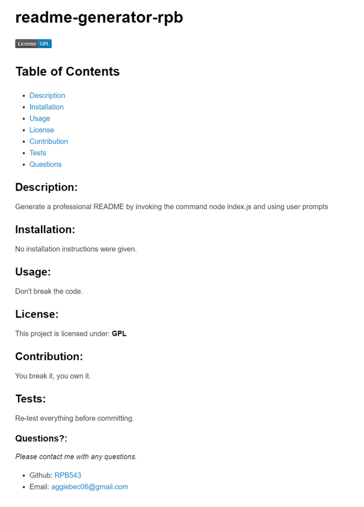

# readme-generator-rpb

## Objective of Challenge

* Generate a professional README file thru user prompts by invoking the following command:

```
node index.js
```

## Acceptance Criteria

* Application accepts user input and a professional readme file is generated with the title of my project and sections entitled Description, Table of Contents, Installation, Usage, License, Contributing, Tests, and Questions
* Title of the project is displayed as the title of the README
* Description, installation instructions, usage information, contribution guidelines, and test instructions are added to the file
* When a badge is selected, it is added to the top of the page, has a section describing the type of license used, and includes a link to the license information
* GitHub username and email address are added to the Questions section
* Table of Contents operates as designed

## Tools used:

* Inquirer package
* Node

## Links 

:relieved:[Repo](https://github.com/RPB543/readme-generator-rpb)\
:smiley: [Github](https://github.com/RPB543)

## Demonstration Video
[Video](https://watch.screencastify.com/v/anQdSHFGX6AiYg6Sb6CS)

## Example of README
